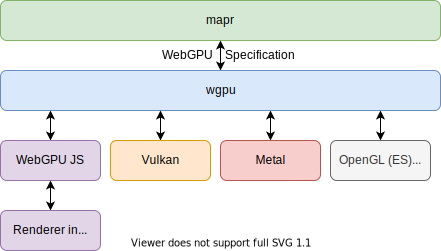
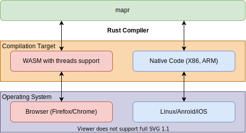

# Architecture

## GPU Architecture

Notes:
* wgpu is able to create an interface through which we can reach any device with a GPU.

## OS Architecture

Notes:
* The ability to use shared memory or the atomic instruction set of WASM comes by enabling compilation features.
* `threads` support here does not introduce threads like we know them from Linux. It introduces 
* [support for atomics](https://github.com/WebAssembly/threads/blob/main/proposals/threads/Overview.md) like
  specified in a working draft to WebAssembly. Threads are simulated using WebWorkers by the browser.
