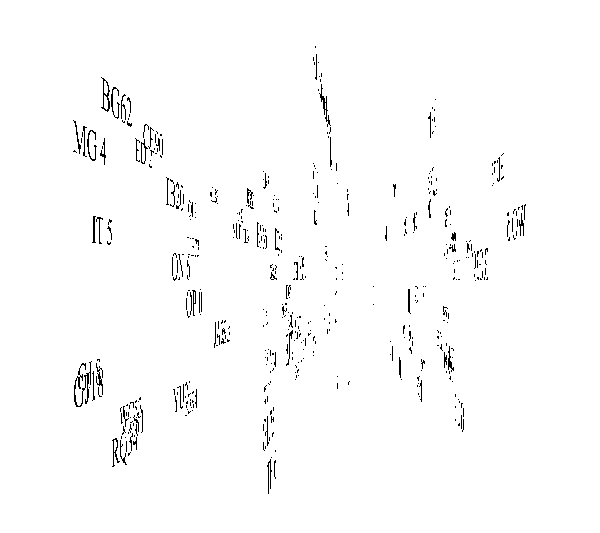
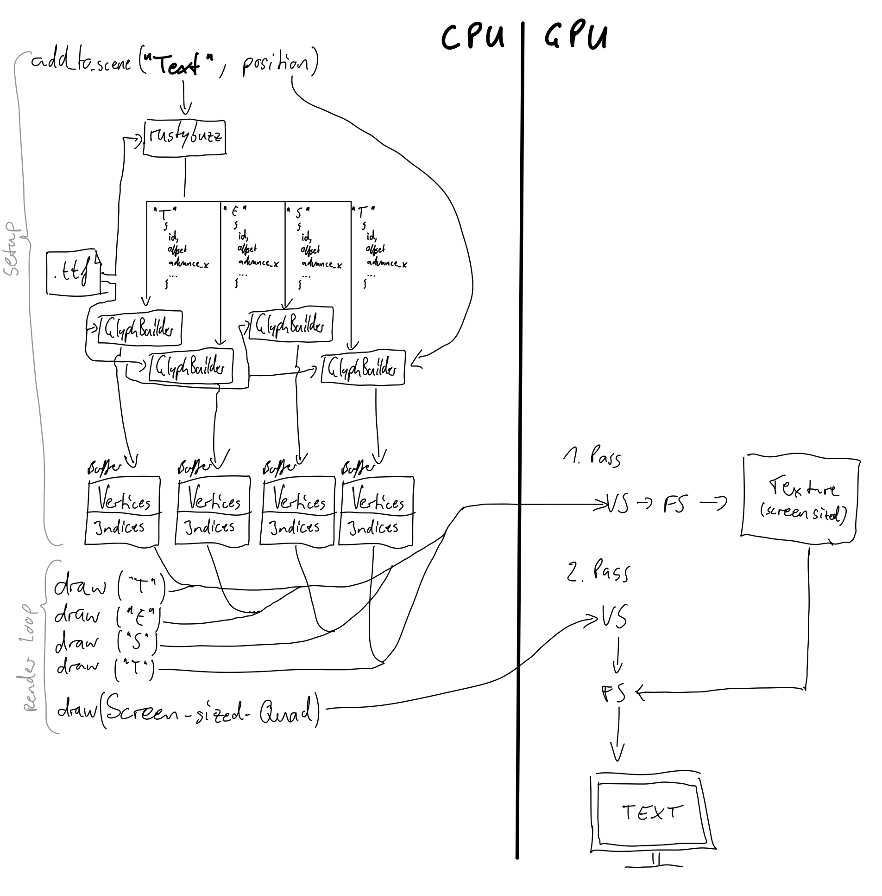
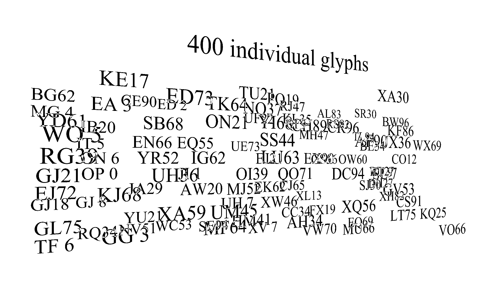

# GPU-based font rendering experiment

This is a standalone wgpu/winit application which serves as an experimentation platform for font rendering on the GPU.

> The goal is not (yet) to provide a fully fleshed out gpu-based font rendering library but rather see w

## Current Approach:
We can render arbitrary text with a .ttf font under arbitrary 3-d transformations on the GPU:

### Algorithm
[Lightweight bezier curve rendering](https://medium.com/@evanwallace/easy-scalable-text-rendering-on-the-gpu-c3f4d782c5ac) was reimplemented:

* Convert ttf outlines into triangle meshes (cpu side, once)
* Use winding order trick to produce correct glyph shape
    - First pass: overdraw pixels into a texture
    - Second pass: render texture but only the pixels that were drawn an uneven number of times

Animation taken from [here](https://medium.com/@evanwallace/easy-scalable-text-rendering-on-the-gpu-c3f4d782c5ac).
* Quadratic curve segments get two triangles, one with special uv coordinates to enable [simple curve evaluation in the fragment shader](https://developer.nvidia.com/gpugems/gpugems3/part-iv-image-effects/chapter-25-rendering-vector-art-gpu)

A rough overview of the setup and render routine:

### Performance
* Parsing/tesselation of glyphs is done with the help of `ttfparser` -> currently unoptimized. With glyph caching this should be ok
* Rendering times degrade massively with number of glyphs, but is independent of screen resolution

### Issues

The main issue with this approach (besides performance) is that the trick with using overdrawing of pixels to decide whether to fill them or not produces artifacts when two separate glyphs overlap in screen space:

However, this should not be a serious problem for our use case (labels on maps) due to two reasons:
1. Text on a map should never overlap because it would be detrimental to readability. Looking at e.g. Google Maps one can see that they have a system in place to detect overlaps and hide text following some sort of importance rating.
2. If we actually want to allow overlapping text, we should get away with a simple painter's algorithm:
    * Sort text entities (i.e., entire labels) by their distance to the camera
    * Draw sorted from closest to farthest
    * Use a depth buffer -> this way all overlapping fragments between texts further back than the closest one are discarded and won't mess with the winding order

### TODOs
* Cache glyph meshes, so they are not recreated whenever they appear in a word and render them as instances
* Anti-aliasing!

## Build setup
This is a separate project from the maplibre-rs, therefore it is excluded from the maplibre-rs workspace and defines its own workspace.

> Running on Mac did not work with a simple `cargo run` (linker error) but with `cargo run --target aarch64-apple-darwin` (on a M1) it worked fine.